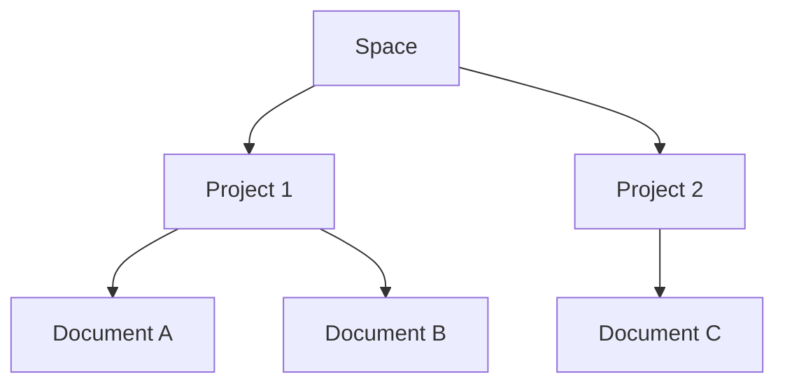

## Overview

iambug organizes your documentation into flexible structures that scale with your needs. You start with **documentation spaces** as top-level containers, then add **projects** for specific initiatives, and finally create **documents** with built-in versioning. This hierarchy enables seamless collaboration while maintaining control over permissions.

<Columns cols={3}>
  <Card title="Spaces" icon="folder" href="#documentation-spaces">
    Top-level containers for your docs.
  </Card>
  <Card title="Projects" icon="git-branch" href="#project-organization-hierarchy">
    Organize work by initiative.
  </Card>
  <Card title="Documents" icon="file-text" href="#document-types-and-versioning">
    Versioned pages with rich editing.
  </Card>
</Columns>

## Documentation Spaces

Documentation spaces act as your primary workspaces in iambug. Create a space for each major area, such as product docs, internal wikis, or customer support knowledge bases. Each space holds multiple projects and supports custom branding, like your brand color `#3B82F6`.

<Callout kind="info">
  Spaces inherit global settings but allow overrides for themes and access rules.
</Callout>

To create a space via API:

<CodeGroup tabs="JavaScript,cURL">
  ```javascript
  const response = await fetch('https://api.example.com/v1/spaces', {
    method: 'POST',
    headers: { 'Authorization': 'Bearer YOUR_API_KEY' },
    body: JSON.stringify({
      name: 'Product Documentation',
      description: 'Official docs for iambug users'
    })
  });
  ```
  ```bash
  curl -X POST https://api.example.com/v1/spaces \
    -H "Authorization: Bearer YOUR_API_KEY" \
    -H "Content-Type: application/json" \
    -d '{
      "name": "Product Documentation",
      "description": "Official docs for iambug users"
    }'
  ```
</CodeGroup>

## Project Organization Hierarchy

Projects live inside spaces and represent focused documentation sets. The hierarchy flows as `Space > Project > Document`. Use projects to group related docs, like API references or user guides.



<Steps>
  <Step title="Create Project" icon="plus">
    Navigate to your space and select **New Project**.
  </Step>
  <Step title="Add Documents">
    Upload MDX files or create new pages directly.
  </Step>
  <Step title="Set Permissions">
    Assign roles at the project level.
  </Step>
</Steps>

## Document Types and Versioning

iambug supports MDX documents with automatic versioning. Choose from standard pages, API references, or changelogs. Each edit creates a new version, preserving history.

<Tabs>
  <Tab title="Standard Page" icon="file">
    Basic MDX content for guides and concepts.
  </Tab>
  <Tab title="API Reference" icon="code">
    Use `<ParamField>` and `<ResponseField>` components.
  </Tab>
  <Tab title="Changelog" icon="git-commit">
    Leverage `<Update>` for release notes.
  </Tab>
</Tabs>

View versions with this API call:

<ParamField path="spaceId" param-type="string" required="true">
  ID of the parent space.
</ParamField>

<ParamField path="projectId" param-type="string" required="true">
  ID of the parent project.
</ParamField>

<ParamField path="documentId" param-type="string" required="true">
  Unique document identifier.
</ParamField>

## Collaboration and Permissions

Control access with role-based permissions: Viewer, Editor, Admin. Assign at space, project, or document levels. Real-time editing supports multiple users without conflicts.

<Expandable title="Advanced Permission Rules" default-open="false">

  Use granular rules for branches and previews:

  ```javascript
  {
    "role": "editor",
    "scopes": ["read", "write", "publish"],
    "branches": ["main", "develop"]
  }
  ```

</Expandable>

<Callout kind="tip">
  Start with broad space permissions, then tighten at the project level for security.
</Callout>

Master these concepts to build scalable documentation workflows in iambug. Next, explore [quickstart](/quickstart) for hands-on setup.