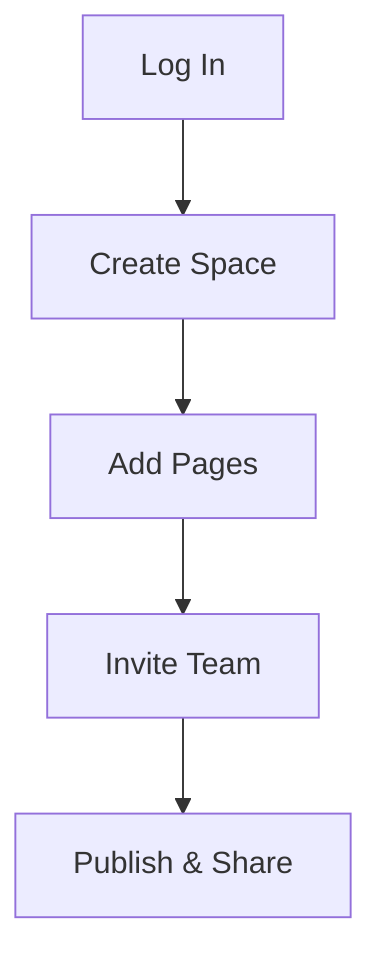

## Overview

iambug provides a centralized space to organize and manage all your project documentation. You create, edit, and collaborate on docs without leaving your workflow. Use it to build knowledge bases, API references, and onboarding guides tailored to your team.

The platform integrates seamlessly with your tools, supports rich content like code examples and diagrams, and scales with your projects. Start by inviting team members and structuring your content hierarchy.

<Callout kind="info">
  iambug uses brand color `{`#3B82F6`}` for primary elements. Apply it to headings, buttons, and links for consistent branding.
</Callout>

## Key Benefits

iambug delivers value through simplicity, collaboration, and flexibility.

<Columns cols={3}>
  <Card title="Centralized Organization" icon="folder" href="#basic-workflow">
    Keep all docs in one searchable space. Tag, categorize, and link content effortlessly.
  </Card>
  <Card title="Team Collaboration" icon="users" href="/quickstart">
    Real-time editing, comments, and version history ensure everyone stays aligned.
  </Card>
  <Card title="Rich Content Support" icon="edit-3" href="#">
    Embed code, diagrams, videos, and interactive components directly in pages.
  </Card>
</Columns>

## Basic Workflow

Follow these steps to navigate and use iambug effectively.

<Steps>
  <Step title="Create a Space" icon="plus">
    Log in at `https://app.iambug.com` and select **New Space**. Name it for your project, like "API Docs".
  </Step>
  <Step title="Add Documentation" icon="file-text">
    Click **New Page** in the sidebar. Use the editor for markdown, components, and embeds.
  </Step>
  <Step title="Collaborate" icon="share-2">
    Invite users via email. Assign roles like Editor or Viewer.
  </Step>
  <Step title="Publish" icon="globe">
    Set pages to public or share links. Track changes with version history.
  </Step>
</Steps>



## Quick Start Example

Embed custom components or code in your docs. Here's a multi-language setup snippet.

<CodeGroup tabs="JavaScript,Python">
  ```javascript
  // Initialize iambug client
  import { iambug } from '@iambug/client';

  const client = iambug({
    apiKey: 'YOUR_API_KEY',
    spaceId: 'your-space-id'
  });

  await client.pages.create({
    title: 'Welcome',
    content: '# Hello iambug'
  });
  ```
  ```python
  # Initialize iambug client
  from iambug import Client

  client = Client(
      api_key='YOUR_API_KEY',
      space_id='your-space-id'
  )

  client.pages.create(
      title='Welcome',
      content='# Hello iambug'
  )
  ```
</CodeGroup>

## Next Steps

Dive deeper into iambug features.

<Columns cols={2}>
  <Card title="Quickstart Guide" icon="zap" href="/quickstart">
    Set up your first space in under 5 minutes.
  </Card>
  <Card title="Authentication" icon="shield" href="/authentication">
    Secure your docs with API keys and roles.
  </Card>
</Columns>

<Callout kind="tip">
  Customize your sidebar navigation and apply the brand color `{`#3B82F6`}` in theme settings for a polished look.
</Callout>